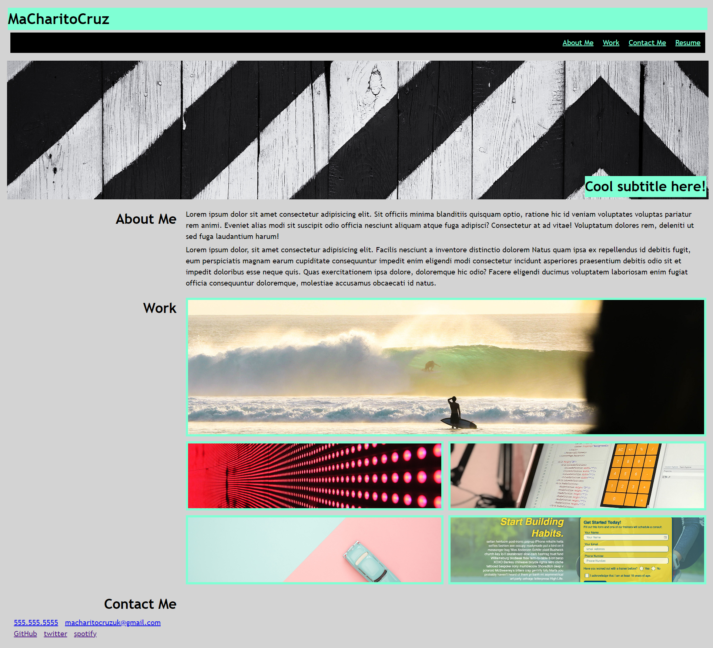
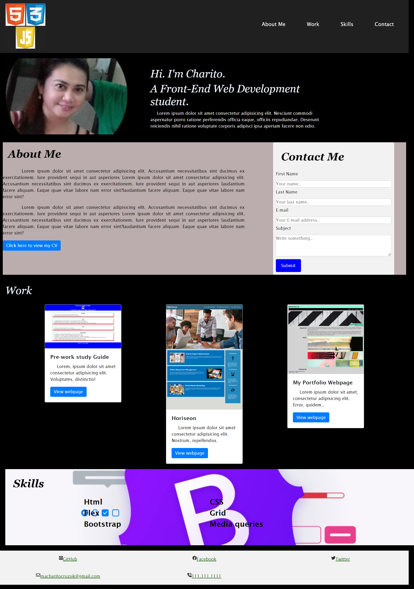
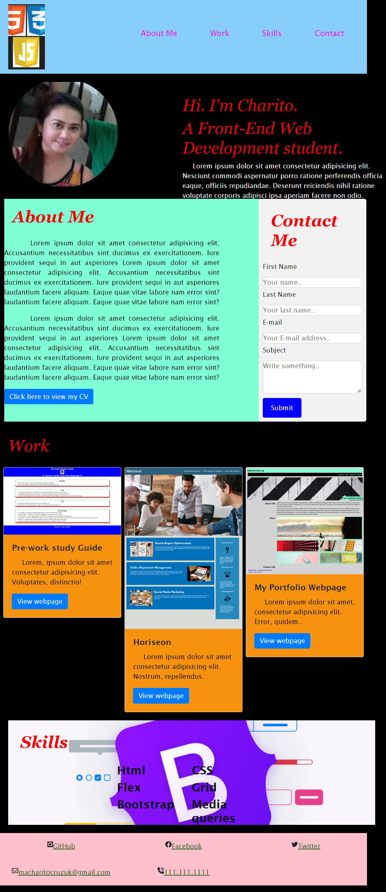

# Bootstrap Portfolio

## Table of Content

1.  Description
2.  Visual
3.  Built with:
4.  What I learned
5.  Links
6.  Resources
7.  License

## 1. Description

Portfolio webpage composed with bootstrap.

## 2. Visual

### Pre-work study Guide

### Horiseon Website Project

### My Portfolio Webpage

### Bootstrap Portfolio Webpage

### Bootstrap Portfolio with Media queries max-width of 900px

## 3. Built with:

- Media Queries
- Flexbox
- CSS Grid
- Bootstrap
- HTML
- CSS

## 4. What I learned

To see how you can add code snippets, see below:

### Media query

@media screen and (max-width: 450px) {

{
background-color: yellowgreen;
}
}

### CSS Grid

.grid-templateAreas {
display: grid;
background-position: center;
background-size: cover;
background-repeat: no-repeat;
cursor: pointer;
border: 5px aquamarine solid;
height: 380px;
}

### Flexbox

ul {
display: flex;
justify-content: flex-end;
flex-wrap: wrap;
background-color: black;
}

### Bootstrap

< div class="jumbotron jumbotron-fluid">

< div class="container">
< h1 class="display-4">Fluid jumbotron</h1>
< p class="lead">This is a modified jumbotron that occupies the entire horizontal space of its parent.

< /div>
< /div>

< div class="card" style="width: 18rem;">

< div class="card-body">
< h5 class="card-title">Card title</h5>
< h6 class="card-subtitle mb-2 text-muted">Card subtitle</h6>
< p class="card-text">Some quick example text to build on the card title and make up the bulk of the card's content.

< a href="#" class="card-link">Card link</a>
< a href="#" class="card-link">Another link</a>
< /div>
< /div>

## 5. Links

### Source code location

https://github.com/chari00/Bootstrap-Portfolio

### Website URL

https://chari00.github.io/Bootstrap-Portfolio/

## 6. Resources

### URL for resources

- https://getbootstrap.com/docs/4.3/components/jumbotron/

- https://www.w3schools.com/howto/howto_css_contact_form.asp

- https://fontawesome.com/icons

- https://developer.mozilla.org/en-US/docs/Learn

## 7. License

This project is licensed by MIT.
